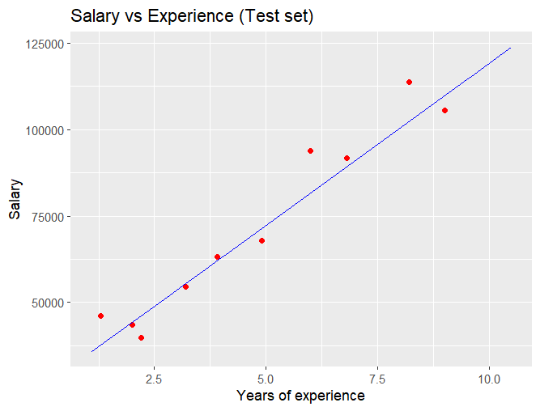

# Simple Linear Regression in R

This project demonstrates a simple linear regression model built in R to predict **Salary** based on **Years of Experience**.

## 📊 Dataset
The dataset contains two variables:
- `YearsExperience`: Number of years the person has worked
- `Salary`: Corresponding salary

Source: [(Salary_Data.csv)](https://github.com/SemaGasimzade/Simple-Linear-Regression/blob/main/Salary_Data.csv)

## 🧮 Model Description

- **Language**: R
- **Libraries used**: `caTools`, `ggplot2`
- **Model type**: Simple Linear Regression

The dataset is split into a training and test set using `caTools`. The regression model is trained on the training data and evaluated visually on both the training and test sets.

## 📈 Output

Below is the plot showing the test set results:



The red dots represent the actual salaries, while the blue line is the predicted regression line.

## 🗂 Files Included
- `regression_model.R` — the R code used for model training and visualization
- `Salary_Data.csv` — the dataset used
- `Rplot.png` — the plot showing regression results

## 🚀 How to Run

1. Make sure you have R installed.
2. Install necessary packages:
   ```R
   install.packages("caTools")
   install.packages("ggplot2")
